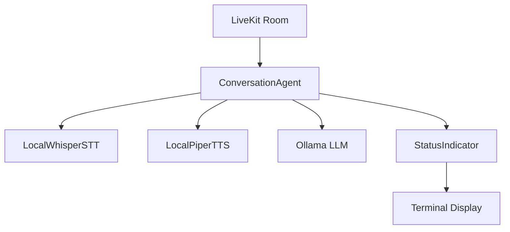

# System Patterns: Ada Voice Agent Architecture

## Core Architecture Patterns

### Voice Pipeline Pattern
**Event-Driven Audio Processing**
```
Audio Input → VAD → STT → LLM → TTS → Audio Output
     ↓         ↓     ↓     ↓     ↓         ↓
Status Indicators for each processing stage
```

**Key Components:**
- `ConversationAgent`: Orchestrates the entire voice pipeline
- `StatusIndicator`: Manages real-time status display
- `LocalWhisperSTT`: Handles speech-to-text conversion
- `LocalPiperTTS`: Handles text-to-speech synthesis
- LiveKit `Room` and `Agent`: Manages WebRTC audio streams

### Audio Format Management Pattern
**Multi-Rate Audio Handling**
- **Input**: 48kHz from LiveKit → downsample to 16kHz for Whisper
- **Processing**: 16kHz internal processing for STT
- **Output**: Piper generates 22kHz → resample to 48kHz for LiveKit
- **Monitoring**: Real-time RMS calculation for status indicators

### State Management Pattern
**Pipeline State Tracking**
```python
# Agent tracks multiple concurrent states
self.is_recording = False          # Audio capture state
self.is_transcribing = False       # STT processing state  
self.is_thinking = False           # LLM processing state
self.is_speaking = False           # TTS output state
self.is_agent_speaking = False     # Prevents self-interruption
```

### Turn-Taking Pattern
**Voice Activity Detection with Thresholds**
```python
SPEECH_THRESHOLD = 200             # RMS level for speech detection
MIN_SPEECH_FRAMES = 20             # 0.4 seconds to start recording
MAX_SILENCE_FRAMES = 40            # 0.8 seconds to stop recording
```

**Anti-Echo Pattern**: Agent pauses processing during its own speech output to prevent feedback loops.

## Critical Implementation Patterns

### LiveKit Integration Pattern
**Agent-as-Worker Architecture**
- Agent registers as LiveKit worker
- Auto-joins rooms when participants connect
- Publishes audio track for TTS output
- Subscribes to participant audio for input processing

### Error Handling Pattern
**Graceful Degradation**
- Component initialization validates all dependencies
- Runtime errors are logged but don't crash the pipeline
- Audio processing continues even if individual frames fail
- Status indicators show error states visually

### Local Service Integration Pattern
**Local Model Management**
- Whisper: `faster-whisper` for optimized local STT
- Piper: Command-line integration via subprocess
- Ollama: OpenAI-compatible HTTP API calls
- Models load once at startup, reused throughout session

### Async Processing Pattern
**Thread Pool Execution**
```python
# CPU-intensive tasks run in executor
loop = asyncio.get_event_loop()
result = await loop.run_in_executor(None, sync_function, args)
```
Used for Whisper transcription and Piper synthesis to prevent blocking the main event loop.

### Status Display Pattern
**Real-Time Visual Feedback**
```
🔊 [████████░░] 5432 | 🔴 RECORDING → 🎙️ TRANSCRIBING → 🤔 THINKING → 📢 SPEAKING
```
- Audio level meter with RMS values
- Pipeline stage indicators with emojis
- Rate-limited updates (10Hz max) to prevent terminal flooding

## Component Relationships

### Primary Dependencies


### Audio Flow Architecture


## Design Decisions

### Why Local-First?
- **Privacy**: No data leaves the local machine
- **Latency**: Eliminates network round-trips
- **Reliability**: Works without internet connectivity
- **Cost**: No per-request API charges

### Why LiveKit?
- **Real-time**: Optimized WebRTC for low-latency audio
- **Scalability**: Room-based architecture supports multiple clients
- **Ecosystem**: Rich agent framework and tooling
- **Quality**: Production-grade audio processing

### Why These Models?
- **Whisper**: Best accuracy for local STT
- **Piper**: Fast, high-quality local TTS
- **Ollama**: Easy local LLM deployment with OpenAI compatibility

This architecture prioritizes real-time performance, local privacy, and maintainable code structure.